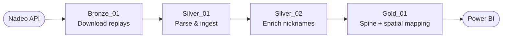
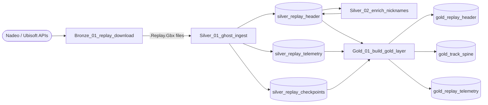
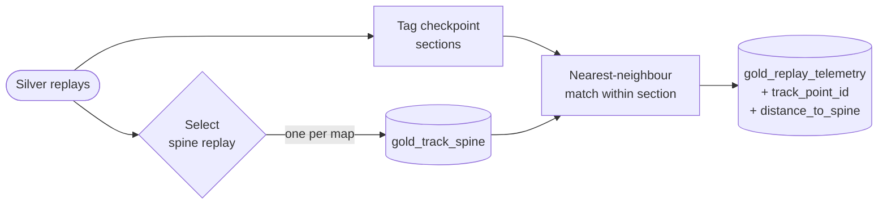
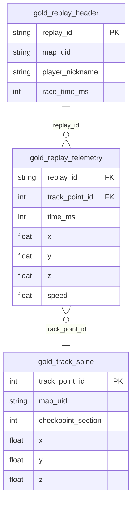

# TM2020 GBX Parser

> Pure-Python parser for TrackMania 2020 `.Gbx` / `.Ghost.Gbx` replay files — extracts 52-field telemetry at 20 Hz and feeds a Microsoft Fabric Lakehouse Medallion pipeline.

 

## Features

- **Pure Python** — stdlib only (`struct`, `zlib`, `io`); no native dependencies for `.Ghost.Gbx` files
- **52-field telemetry** — position, velocity, rotation, inputs, suspension, tire conditions, reactor state at 50 ms intervals
- **Dual compression** — zlib (`.Ghost.Gbx`) and optional LZO (legacy `.Replay.Gbx`) support
- **Medallion Architecture** — Bronze → Silver → Gold Fabric notebooks included
- **Power BI ready** — Gold layer writes a star-schema optimised for dashboards

---

## Pipeline Overview



---

## Notebooks

| Step | Notebook | Layer | What it does |
|------|----------|-------|--------------|
| 1 | `Bronze_01_replay_download` | Bronze | Authenticates with Ubisoft/Nadeo APIs, fetches leaderboard top N + tracked players, downloads `.Replay.Gbx` files |
| 2 | `Silver_01_ghost_ingest` | Silver | Parses `.Gbx`/`.Ghost.Gbx` files → three Silver Delta tables |
| 3 | `Silver_02_enrich_nicknames` | Silver | Batch-looks up Trackmania display names, MERGE-updates `silver_replay_header` |
| 4 | `Gold_01_build_gold_layer` | Gold | Builds track spine, assigns checkpoint sections, spatially maps telemetry to spine, writes Gold tables |

### Notebook Data Flow



---

## Delta Tables

| Layer | Table | Key columns | Description |
|-------|-------|-------------|-------------|
| Silver | `silver_replay_header` | `replay_id`, `account_id`, `map_uid`, `race_time_ms` | One row per replay — metadata and player info |
| Silver | `silver_replay_telemetry` | `replay_id`, `time_ms`, `x/y/z`, `speed` | One row per sample (52 fields at ~50 ms) |
| Silver | `silver_replay_checkpoints` | `replay_id`, `cp_index`, `time_ms` | Checkpoint crossing times per replay |
| Gold | `gold_replay_header` | `replay_id`, `player_nickname`, `source` | Silver header copy + ingestion timestamp |
| Gold | `gold_track_spine` | `track_point_id`, `map_uid`, `checkpoint_section`, `x/y/z` | Track dimension — spatial reference for each map |
| Gold | `gold_replay_telemetry` | `replay_id`, `track_point_id`, `distance_to_spine` | All 52 fields mapped to spine + distance metrics |

---

## Track Spine & Spatial Mapping

The **track spine** is one reference run per map (defaults to the slowest replay for a smoother line, overridable). Every telemetry point is tagged with a `checkpoint_section` and spatially matched to the nearest spine point **within the same section**.

> [!NOTE]
> **Why space over time?** At t = 13 s, two players may be at entirely different track positions. By mapping all telemetry to the *same place* on the track, you can compare braking points, speed profiles, and racing lines — not just race times.



| Column | Formula |
|--------|---------|
| `distance_per_sample` | `speed × 0.05` (50 ms window) |
| `cumulative_distance` | running sum per replay ordered by `time_ms` |
| `distance_to_spine` | 3D Euclidean distance to matched spine point |

> [!TIP]
> **Checkpoint section optimisation** — matching only within the same CP section dramatically reduces computation and provides a natural Power BI slicer for per-section analysis.

---

## Power BI Data Model

Connect Power BI to the three Gold tables only.



---

## Parser Library

### Installation

```bash
pip install -e .
# Optional: LZO support for legacy .Replay.Gbx files
pip install "python-lzo>=1.14"
```

### Usage

```python
from tm_gbx import parse_gbx

result = parse_gbx("replay.Ghost.Gbx")

print(result["metadata"]["player_nickname"])   # e.g. "Wirtual"
print(result["metadata"]["race_time_ms"])      # e.g. 47832
print(result["ghost_info"]["num_samples"])     # e.g. 958

for sample in result["ghost_samples"][:3]:
    print(sample["time_ms"], sample["x"], sample["y"], sample["z"], sample["speed"])
```

> [!TIP]
> The `speed` field is Trackmania's native unit (`exp(i16/1000)`). Convert to km/h with `speed_kmh = speed * 3.6`.

<details>
<summary>52 telemetry fields per sample</summary>

| Field | Type | Description |
|-------|------|-------------|
| `time_ms` / `time_s` | int / float | Sample timestamp |
| `x`, `y`, `z` | float | Position (metres) |
| `speed` | float | Speed (native units) |
| `side_speed` | float | Lateral speed |
| `vel_x`, `vel_y`, `vel_z` | float | Velocity vector |
| `pitch_deg`, `yaw_deg`, `roll_deg` | float | Euler angles (degrees) |
| `steer` | float | Steering [-1, 1] |
| `gas` | float | Gas pedal [0, 1] |
| `brake` | float | Brake pedal [0, 1] |
| `gear` | float | Current gear |
| `rpm` | int | Engine RPM (0–255) |
| `is_turbo` | bool | Turbo active |
| `turbo_time` | float | Turbo charge [0, 1] |
| `reactor_state` | int | 0=off 1=ground 2=up 3=down |
| `reactor_boost` | int | Boost level 0–2 |
| `reactor_pedal` | int | −1=brake 0=none 1=accel |
| `reactor_steer` | int | −1=left 0=none 1=right |
| `is_ground_contact` | bool | Wheels on ground |
| `is_top_contact` | bool | Roof contact |
| `sim_time_coef` | float | Simulation time coefficient |
| `wetness` | float | Surface wetness [0, 1] |
| `fl/fr/rr/rl_dampen` | float | Suspension compression (4 wheels) |
| `fl/fr/rr/rl_ice` | float | Ice coefficient [0, 1] (4 wheels) |
| `fl/fr/rr/rl_dirt` | float | Dirt coefficient [0, 1] (4 wheels) |
| `fl/fr/rr/rl_slip` | bool | Wheel slip (4 wheels) |
| `fl/fr/rr/rl_ground_mat` | int | Surface material ID (4 wheels) |
| `fl/fr/rr/rl_wheel_rot` | float | Wheel rotation in radians (4 wheels) |

</details>

### Modules

| Module | Purpose |
|--------|---------|
| `tm_gbx.parser` | `parse_gbx()` entry point |
| `tm_gbx.ghost` | `CPlugEntRecordData` → `CSceneVehicleVis` (107 bytes/sample) |
| `tm_gbx.header` | Header chunk parsing |
| `tm_gbx.reader` | Binary reading primitives |
| `tm_gbx.lookback` | GBX string interning |

---

## Getting Started

### Prerequisites

- Python 3.7+
- **Microsoft Fabric workspace** with Lakehouse (for the notebook pipeline)
- **Ubisoft account** with Trackmania access (for Bronze download notebook)
- **Trackmania OAuth app** credentials (for Silver nickname enrichment)

### Run locally (parser only)

```bash
git clone https://github.com/villezekeviking/tm2020-gbx-parser.git
cd tm2020-gbx-parser
pip install -e .
python examples/basic_usage.py
```

### Tests

```bash
python -m pytest tests/test_parser.py -v
```

---

## Credits

- [gbx-net](https://github.com/BigBang1112/gbx-net) — C# GBX parser reference (`CPlugEntRecordData`, `CSceneVehicleVis`)
- [pygbx](https://github.com/schadocalex/gbx.py) — Python GBX parser inspiration

